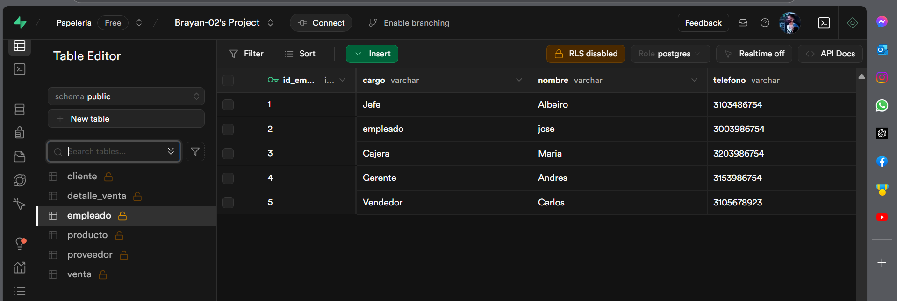
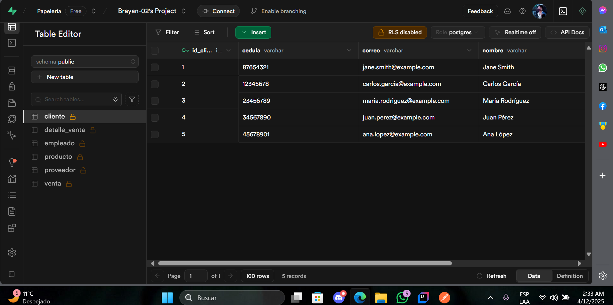
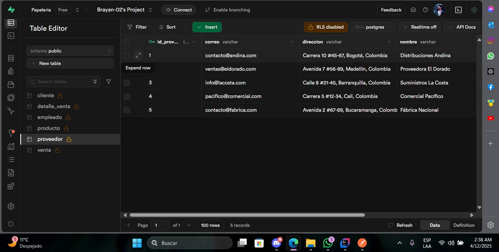
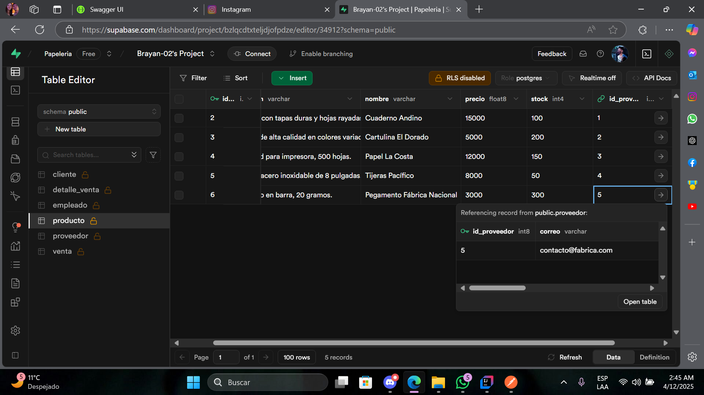
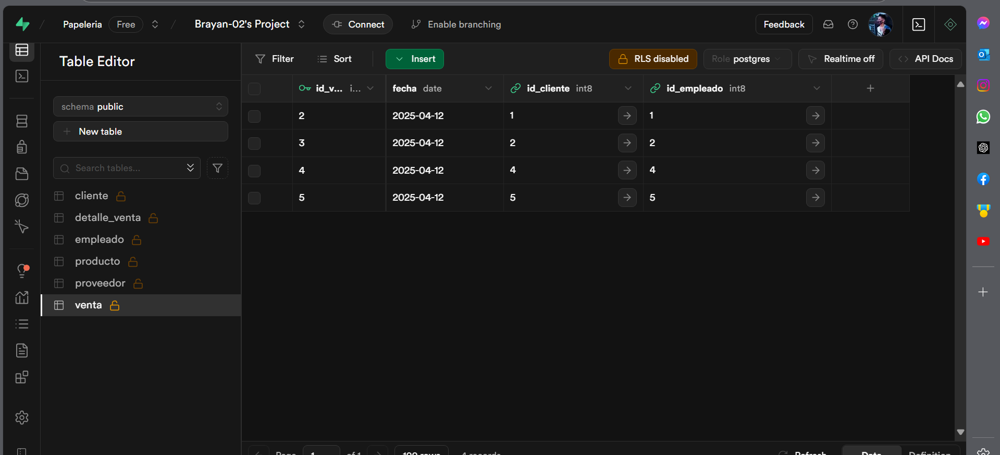
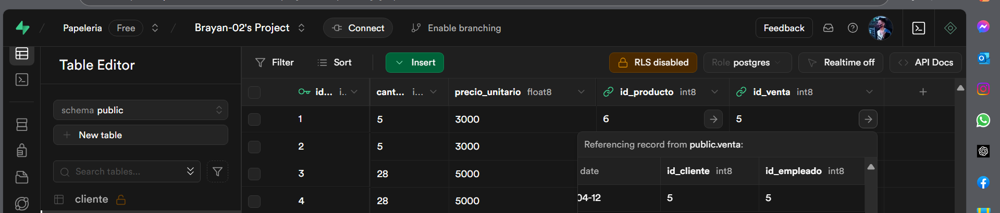

# Sistema de Papelería API

Este proyecto es una **API RESTful** desarrollada con **Spring Boot**, que permite gestionar las operaciones de ventas, productos, proveedores y empleados para un sistema de papelería. La base de datos utilizada es **Supabase**, y se configura en el archivo `.env`.

---

## Tecnologías Utilizadas

- **Spring Boot**: Framework para el desarrollo de la API.
- **JPA (Java Persistence API)**: Para interactuar con la base de datos.
- **PostgreSQL**: Base de datos utilizada (con Supabase).
- **Swagger**: Para la documentación y pruebas de la API.
- **Lombok**: Librería para reducir el código repetitivo.
- **JUnit**: Para las pruebas unitarias.

---

## Estructura del Proyecto

La estructura del proyecto sigue una organización común en aplicaciones Spring Boot:

---

## Configuración de la Conexión a Supabase

La conexión a la base de datos Supabase se configura utilizando un archivo `.env`, que contiene las credenciales necesarias para establecer la conexión de manera segura y flexible. Este archivo almacena las siguientes variables:

Estas variables de entorno son leídas por la aplicación desde el archivo `.env`, y son utilizadas en la configuración de la base de datos en el archivo `application.properties`, lo que permite que la aplicación se conecte correctamente a Supabase sin exponer información sensible en el código.

Este enfoque ofrece mayor seguridad, flexibilidad y facilita la administración de configuraciones en diferentes entornos (desarrollo, pruebas, producción).

---

## Controladores

Los **controladores** en una aplicación **Spring Boot** son responsables de exponer los **endpoints** de la API. Estos endpoints permiten que los clientes (por ejemplo, navegadores web, aplicaciones móviles, etc.) interactúen con la aplicación, enviando solicitudes HTTP (GET, POST, PUT, DELETE) y recibiendo respuestas.

En otras palabras, los controladores son los encargados de manejar las solicitudes de los usuarios, invocar la lógica de negocio necesaria (a través de los **servicios**) y devolver la respuesta adecuada. Los controladores actúan como puentes entre el **frontend** (o los clientes) y la **capa de lógica de negocio** (servicios y base de datos).

### Funciones principales de los controladores:

- **Exponer los endpoints**: Los controladores definen las rutas que estarán disponibles en la API. Estas rutas se utilizan para acceder a los recursos de la aplicación (por ejemplo, obtener productos, realizar ventas, consultar empleados, etc.).

- **Gestionar las solicitudes HTTP**: Los controladores escuchan solicitudes HTTP de los clientes y las procesan según el verbo HTTP correspondiente (GET, POST, PUT, DELETE). Dependiendo de la solicitud, los controladores invocan los métodos apropiados en los servicios.

- **Devolver respuestas**: Una vez que el controlador procesa la solicitud, devuelve una respuesta al cliente. Esto puede ser un código de estado HTTP (por ejemplo, `200 OK`, `404 Not Found`, `500 Internal Server Error`) y, en muchos casos, un cuerpo de respuesta en formato **JSON** con los datos solicitados o un mensaje.

---

## Servicios

Los **servicios** son una parte fundamental de la arquitectura de la aplicación, ya que **contienen la lógica de negocio** y gestionan las operaciones sobre los datos. A través de la interacción con los **repositorios**, los servicios aseguran que las operaciones de lectura y escritura en la base de datos sean realizadas de manera eficiente y ordenada.

Además, los servicios facilitan el mantenimiento y las pruebas de la aplicación al mantener la lógica de negocio separada de la capa de presentación (**controladores**).

### Funciones principales de los servicios:

- **Lógica de negocio**: Los servicios implementan las reglas y operaciones que definen cómo se deben procesar los datos (por ejemplo, cálculos, validaciones, transformaciones).

- **Interacción con repositorios**: Los servicios utilizan los repositorios para realizar operaciones de lectura, escritura, actualización y eliminación de datos en la base de datos.

- **Desacoplamiento**: Los servicios permiten que los controladores estén desacoplados de la lógica de negocio, lo que facilita la modificación y el mantenimiento de las operaciones sin afectar otras partes del sistema.

- **Facilitan las pruebas**: Los servicios son más fáciles de probar de forma aislada, ya que puedes simular las interacciones con los repositorios y verificar que la lógica de negocio funciona correctamente.

### Base de datos

- **esta estructurada de la siguiente forma**: 

## Swagger

**Swagger** está configurado para documentar tu API. Puedes acceder a la documentación interactiva de la API visitando [http://localhost:8080/swagger-ui.html](http://localhost:8080/swagger-ui.html) después de ejecutar la aplicación.

### Configuración de Swagger

La configuración de Swagger se encuentra en la clase `SwaggerConfig.java`, que define cómo se genera y presenta la documentación de los endpoints de la API.

## Postman

Para realizar pruebas a la API, se recomienda utilizar **Postman**. A continuación, se detallan algunos ejemplos de las peticiones que se pueden realizar:

### 1. **Obtener todos los empleados**
- **Método**: `GET`
- **Ruta**: `/empleados`
- **Respuesta esperada**:
  

## 5 registros por tabla

### **🦾empleados**

### **🤑clientes**

### **🛞proveedores**

### **🛒productos**

### **🛎️ventas**

### **🛎🤝Detalle de venta**

 se evidencia que el cliente 5 oseaAna lopez fue atendida por el vendedor Carlos dondela venta consistio en 5 "Pegamentos Fábrica Nacional"